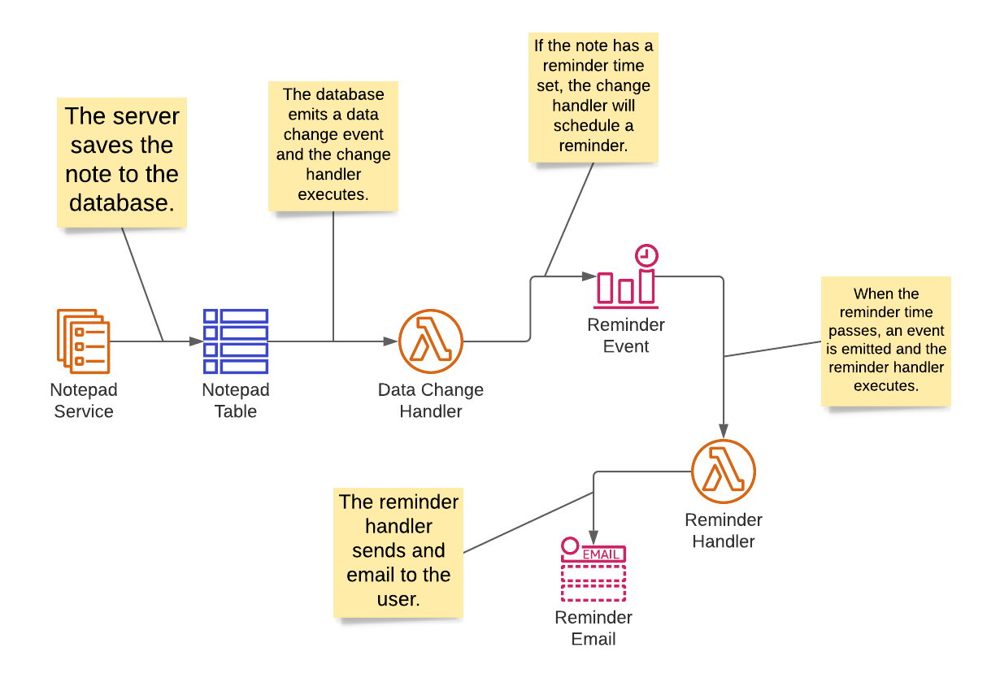

# Unison Senior Quality Engineer Mini-Project
For this mini-project you will need to complete 2 steps. This project will assess your written communication skills,
ability to generate test plans for both manual and automated tests, and create automated tests for a simple API.

_**Please fork this repository and send us the Github link when you are finished. Be prepared to present your plans to
a small team.**_

## The Application
This project is to test a simple notepad application. The only working part of the application is the API. The application
allows you to create and manage notes and to also schedule a reminder for the note. The included server contains full CRUD
operations but does not persist the data when shut down. So you will need to add new data each time.

### The Notepad API
The Notepad API contains full CRUD operations. The following table described the endpoints available:

|HTTP Method|Path|Description|
|-----------|----|-----------|
|GET|/notes|This will retrieve notes from the server. A `query` query string variable can be set to filter the notes.|
|GET|/notes/{id}|This will retrieve a note with the given ID.|
|POST|/notes|This will create a new note from the JSON value in the payload.|
|PUT|/notes/{id}|This will update the note with the given ID using the JSON value in the payload.|
|DELETE|/notes/{id}|This will delete the note with the given ID.|

The Note data is passed as a JSON document. The structure looks like this:
```json
{
  "id": "The ID of the note",
  "title": "The title or text of the note.",
  "schedule": "An optional date and time formatted as an ISO-8601 string."
}
```
Here is an example note:
```json
{
  "id": "c8095d4b-991e-42b7-82f7-298f73950808",
  "title": "Remember to celebrate",
  "schedule": "2022-01-01T00:00:00.000-07:00"
}
```

When creating a note you must include a title and should not include an ID. The ID will be generated by the server. The
title can be between 1 and 200 characters long. When updating a note you should include an ID, and it must match the ID
in the URL path. Updates can be sparse and only include the data you wish to update. Omitting data will keep the existing
data intact.

#### Running The Server

The included server is a Node.js server and will require the Node.js version 12 or later runtime be installed on your
computer. Change to the directory `api` from a terminal or command prompt and run the following commands:

```shell
npm install
npm start
```

The server will start on port 3000. If you have issues using that port you can set an environment variable named `PORT`
and set the value to something that will be suitable for your system. You can view the swagger documentation for the
API by browsing to this URL [http://localhost:3000/documentation](http://localhost:3000/documentation). Change the port
to the correct value is you are not using the default.

### The User Interface
The user interface only exists as a design.


You should be able to create a test plan based on the provided design. No UI automation
tests are needed for this project.

### The Reminder Architecture
The reminder architecture consists of the following design:



This is not functional in this project and is simply here to show a high level design
of how something like this might be implemented. In this design the database emits a change
event, and a Lambda function listens for those changes. If a schedule has been set
then the handler will schedule an email to be sent to the user when the scheduled time passes.

Again, no automation is necsarry for this, but you may include it in your test plans.

# The Project
What we would like are the following items created by you:
* A set of test plans that can cover testing the application. It is up to you 
  as to how much you think should be tested and the extent of the plan. These plans can
  be markdown or simple text files stored in the `docs` directory. If can also store
  word files or provide links to Google docs if you prefer.
    
* Automation tests for the API. This can be in your language of choice, but we would 
  prefer JavaScript or Python. You should make it easy to run the tests allowing us to
  check your work by cloning the repository and executing them per your instructions. Please
  store your tests in the `tests` directory.
  
* Any other documentation you think will help us in understanding your work can also go into the
  `docs` directory.
  
We will assess your written communication skills and your ability to create test plans from the
documents you create. Your coding skills will be assessed from the automation tests
you create.

If you have any questions then please reach out to our HR representative.
